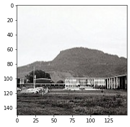
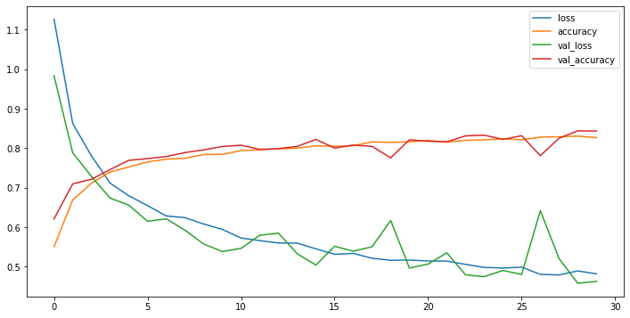
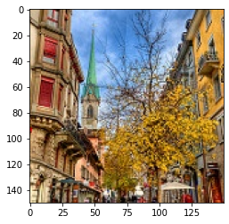
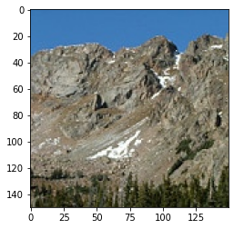
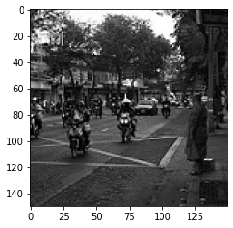
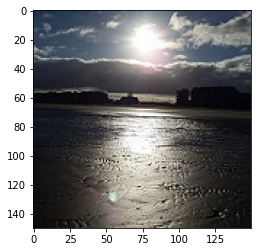
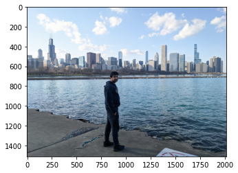

## Intel Image Classification Challenge: 
Given an input image, classify the image in the following category: 
'buildings': 0,
'forest': 1,
'glacier': 2,
'mountain': 3,
'sea': 4,
'street': 5
<br>
</br>
Above are the keys along with their tag (or value) are mentioned.
A CNN model has been used with 3 Conv2D, 3 MaxPool2d, 1 Flatten, one dropout and 2 Dense layers. 
<br>
</br>
After training the CNN model on 14034 images belonging to 6 classes, the CNN model was validated on a validation set with 3000 images belonging to 6 classes, on which an accuracy of 84.17% was achieved.

Steps:
1) Specify train, validation and test directory (where images are stored)
2) Use Image Generator to create more samples out of the given number of training samples (in order to detect the class more accurately). Images went through various processes like: zoomed in/out, sheared, rorated etc.
3) Images from train and validation were subjected to the Image Generator created in step: 2. Note that in training the shuffle was True and that in validation it was False, because we want to keep the validation set in order to evalue the accuracy (which required the images to be in order)
4) Image samples from train directory were fed to the CNN model and evaluated on the validation directory.
5) Image samples from test directory were also predicted and evaluated manually.


```python
# Importing the required packages
import numpy as np
import pandas as pd
import matplotlib.pyplot as plt
import seaborn as sns
%matplotlib inline
import os
```


```python
from matplotlib.image import imread # imorting the function used to read a set of array as an image
```


```python
pwd # checking the present working directory
```


    'C:\\Users\\HP\\Desktop\\Kaggle_Challenges\\Intel Image classification'


```python
my_dir = "C:\\Users\\HP\\Desktop\\Kaggle_Challenges\\Intel Image classification" # setting up a custom directory
```


```python
os.listdir(my_dir) # checking the elements of the custom directory
```


    ['.ipynb_checkpoints', 'seg_pred', 'seg_test', 'seg_train', 'T-1.ipynb']


```python
train_dir = r"C:\Users\HP\Desktop\Kaggle_Challenges\Intel Image classification\seg_train\\seg_train" # setting the training data directory
```


```python
os.listdir(train_dir) # checking the elements training data directory for categories
```


    ['buildings', 'forest', 'glacier', 'mountain', 'sea', 'street']


```python
valid_dir = r"C:\Users\HP\Desktop\Kaggle_Challenges\Intel Image classification\seg_test\\seg_test" # setting the cross validation data directory
```


```python
os.listdir(valid_dir) # checking the elements cross-validaton data directory for categories
```


    ['buildings', 'forest', 'glacier', 'mountain', 'sea', 'street']


```python
test_dir = "C:\\Users\\HP\\Desktop\\Kaggle_Challenges\\Intel Image classification\\seg_pred" # setting the test data directory
```


```python
#os.listdir(test_dir)
```


```python
os.listdir(train_dir+ "\\buildings")[0] # checking the first image from training data directory
```


    '0.jpg'


```python
img1 = imread(train_dir+ "\\buildings"+"\\0.jpg") # reading the image as an array
```


```python
plt.imshow(img1) # disploying the image
```


    <matplotlib.image.AxesImage at 0x232b9a96c70>


    

    


```python
img1.shape # checking the shape (lenght, breadth and color dimensions 'RGB')
```


    (150, 150, 3)


```python
type(img1)
```


    numpy.ndarray


```python
img_shape = (150,150,3) # declaring the desired image shape
```


```python
from tensorflow.keras.preprocessing.image import ImageDataGenerator # importing the function required to create more training samples
```


```python
# creating an image generator instance capable of modifying the image so that our model can get trained on more data samples
image_gen = ImageDataGenerator(rotation_range=20, width_shift_range=0.20, height_shift_range=0.20, rescale=1/255, shear_range=0.2, zoom_range=0.2, horizontal_flip=True, fill_mode='nearest' )
                               
```

### Creating a CNN model


```python
from tensorflow.keras.models import Sequential
from tensorflow.keras.layers import Activation, Dropout, Flatten, Dense, Conv2D, MaxPooling2D
```


```python
model = Sequential() # creating a sequence instance

model.add(Conv2D(filters=64, kernel_size=(3,3),input_shape=img_shape, activation='relu')) # creating a 2D convolution layer with the given parameters
model.add(MaxPooling2D(pool_size=(2, 2))) # creating a 2D Max pooling layer with the given parameters

model.add(Conv2D(filters=64, kernel_size=(3,3),input_shape=img_shape, activation='relu')) # creating a 2D convolution layer with the given parameters
model.add(MaxPooling2D(pool_size=(2, 2))) # creating a 2D Max pooling layer with the given parameters

model.add(Conv2D(filters=64, kernel_size=(3,3),input_shape=img_shape, activation='relu')) # creating a 2D convolution layer with the given parameters
model.add(MaxPooling2D(pool_size=(2, 2))) # creating a 2D Max pooling layer with the given parameters

model.add(Flatten()) # using a flattening layer to make the values 1D to feed forward the network into a normal Dense layer

model.add(Dense(1024,activation='relu')) # Using 1024 nodes in the normal dense layer using 'rectified linear unit' activation

model.add(Dropout(0.5)) # Using a dropout layer to randomly switch off 50% of the nodes of the previous layer to counter 'overfitting' 

model.add(Dense(6,activation='sigmoid')) # creating the output layer for 6 distinct categories

model.compile(loss='categorical_crossentropy',optimizer='adam',metrics=['accuracy']) # compiling the CNN model
```


```python
model.summary() # checking the summary (in a way architecture) of the CNN model
```

    Model: "sequential"
    _________________________________________________________________
    Layer (type)                 Output Shape              Param #   
    =================================================================
    conv2d (Conv2D)              (None, 148, 148, 64)      1792      
    _________________________________________________________________
    max_pooling2d (MaxPooling2D) (None, 74, 74, 64)        0         
    _________________________________________________________________
    conv2d_1 (Conv2D)            (None, 72, 72, 64)        36928     
    _________________________________________________________________
    max_pooling2d_1 (MaxPooling2 (None, 36, 36, 64)        0         
    _________________________________________________________________
    conv2d_2 (Conv2D)            (None, 34, 34, 64)        36928     
    _________________________________________________________________
    max_pooling2d_2 (MaxPooling2 (None, 17, 17, 64)        0         
    _________________________________________________________________
    flatten (Flatten)            (None, 18496)             0         
    _________________________________________________________________
    dense (Dense)                (None, 1024)              18940928  
    _________________________________________________________________
    dropout (Dropout)            (None, 1024)              0         
    _________________________________________________________________
    dense_1 (Dense)              (None, 6)                 6150      
    =================================================================
    Total params: 19,022,726
    Trainable params: 19,022,726
    Non-trainable params: 0
    _________________________________________________________________
    


```python
# Using early stopping to minimzie the chances of 'overfitting'
from tensorflow.keras.callbacks import EarlyStopping
early_stop = EarlyStopping(monitor='val_loss',patience=5,restore_best_weights=True,mode='min')
```


```python
batch_size = 16 # setting a batch size
```


```python
# Feeding in the image to the image genenration instance created above (shuffle is True as we want to 'randomize' our training)
train_image_gen = image_gen.flow_from_directory(train_dir,target_size=img_shape[:2],color_mode='rgb', batch_size=batch_size,class_mode='categorical', shuffle=True)                                       
```

    Found 14034 images belonging to 6 classes.
    


```python
# Feeding in the image to the image genenration instance created above (shuffle is False as we want the validation samples to be in the given order)
valid_image_gen = image_gen.flow_from_directory(valid_dir,target_size=img_shape[:2],color_mode='rgb', batch_size=batch_size,class_mode='categorical', shuffle=False)                                       
```

    Found 3000 images belonging to 6 classes.
    


```python
train_image_gen.class_indices
```


    {'buildings': 0,
     'forest': 1,
     'glacier': 2,
     'mountain': 3,
     'sea': 4,
     'street': 5}


```python
valid_image_gen.class_indices
```


    {'buildings': 0,
     'forest': 1,
     'glacier': 2,
     'mountain': 3,
     'sea': 4,
     'street': 5}


#### Fitting the model on training image generator (fed from training data directory) and validating it on validation image generator (fed from validation data directory)


```python
#results = model.fit_generator(train_image_gen,epochs=30, validation_data=valid_image_gen,callbacks=[early_stop])
```

    E:\anaconda\lib\site-packages\keras\engine\training.py:1972: UserWarning: `Model.fit_generator` is deprecated and will be removed in a future version. Please use `Model.fit`, which supports generators.
      warnings.warn('`Model.fit_generator` is deprecated and '
    

    Epoch 1/30
    878/878 [==============================] - 635s 723ms/step - loss: 1.1271 - accuracy: 0.5504 - val_loss: 0.9837 - val_accuracy: 0.6210
    Epoch 2/30
    878/878 [==============================] - 641s 730ms/step - loss: 0.8625 - accuracy: 0.6690 - val_loss: 0.7883 - val_accuracy: 0.7097
    Epoch 3/30
    878/878 [==============================] - 644s 733ms/step - loss: 0.7806 - accuracy: 0.7113 - val_loss: 0.7284 - val_accuracy: 0.7213
    Epoch 4/30
    878/878 [==============================] - 649s 739ms/step - loss: 0.7115 - accuracy: 0.7398 - val_loss: 0.6735 - val_accuracy: 0.7460
    Epoch 5/30
    878/878 [==============================] - 2380s 3s/step - loss: 0.6794 - accuracy: 0.7525 - val_loss: 0.6557 - val_accuracy: 0.7693
    Epoch 6/30
    878/878 [==============================] - 607s 691ms/step - loss: 0.6546 - accuracy: 0.7652 - val_loss: 0.6148 - val_accuracy: 0.7737
    Epoch 7/30
    878/878 [==============================] - 639s 727ms/step - loss: 0.6284 - accuracy: 0.7723 - val_loss: 0.6211 - val_accuracy: 0.7790
    Epoch 8/30
    878/878 [==============================] - 644s 734ms/step - loss: 0.6241 - accuracy: 0.7743 - val_loss: 0.5924 - val_accuracy: 0.7890
    Epoch 9/30
    878/878 [==============================] - 642s 731ms/step - loss: 0.6079 - accuracy: 0.7840 - val_loss: 0.5572 - val_accuracy: 0.7957
    Epoch 10/30
    878/878 [==============================] - 7712s 9s/step - loss: 0.5942 - accuracy: 0.7846 - val_loss: 0.5382 - val_accuracy: 0.8043
    Epoch 11/30
    878/878 [==============================] - 599s 682ms/step - loss: 0.5724 - accuracy: 0.7939 - val_loss: 0.5463 - val_accuracy: 0.8077
    Epoch 12/30
    878/878 [==============================] - 42073s 48s/step - loss: 0.5659 - accuracy: 0.7959 - val_loss: 0.5795 - val_accuracy: 0.7970
    Epoch 13/30
    878/878 [==============================] - 632s 719ms/step - loss: 0.5598 - accuracy: 0.7986 - val_loss: 0.5847 - val_accuracy: 0.7990
    Epoch 14/30
    878/878 [==============================] - 658s 749ms/step - loss: 0.5596 - accuracy: 0.8001 - val_loss: 0.5326 - val_accuracy: 0.8047
    Epoch 15/30
    878/878 [==============================] - 686s 781ms/step - loss: 0.5450 - accuracy: 0.8062 - val_loss: 0.5040 - val_accuracy: 0.8223
    Epoch 16/30
    878/878 [==============================] - 692s 788ms/step - loss: 0.5313 - accuracy: 0.8048 - val_loss: 0.5515 - val_accuracy: 0.8003
    Epoch 17/30
    878/878 [==============================] - 678s 772ms/step - loss: 0.5334 - accuracy: 0.8063 - val_loss: 0.5390 - val_accuracy: 0.8080
    Epoch 18/30
    878/878 [==============================] - 683s 778ms/step - loss: 0.5211 - accuracy: 0.8159 - val_loss: 0.5503 - val_accuracy: 0.8047
    Epoch 19/30
    878/878 [==============================] - 649s 739ms/step - loss: 0.5161 - accuracy: 0.8147 - val_loss: 0.6168 - val_accuracy: 0.7757
    Epoch 20/30
    878/878 [==============================] - 639s 727ms/step - loss: 0.5166 - accuracy: 0.8159 - val_loss: 0.4965 - val_accuracy: 0.8213
    Epoch 21/30
    878/878 [==============================] - 646s 736ms/step - loss: 0.5143 - accuracy: 0.8200 - val_loss: 0.5064 - val_accuracy: 0.8177
    Epoch 22/30
    878/878 [==============================] - 646s 736ms/step - loss: 0.5139 - accuracy: 0.8154 - val_loss: 0.5350 - val_accuracy: 0.8163
    Epoch 23/30
    878/878 [==============================] - 648s 738ms/step - loss: 0.5057 - accuracy: 0.8199 - val_loss: 0.4790 - val_accuracy: 0.8313
    Epoch 24/30
    878/878 [==============================] - 678s 772ms/step - loss: 0.4979 - accuracy: 0.8214 - val_loss: 0.4746 - val_accuracy: 0.8330
    Epoch 25/30
    878/878 [==============================] - 655s 746ms/step - loss: 0.4964 - accuracy: 0.8238 - val_loss: 0.4903 - val_accuracy: 0.8223
    Epoch 26/30
    878/878 [==============================] - 646s 736ms/step - loss: 0.4986 - accuracy: 0.8216 - val_loss: 0.4801 - val_accuracy: 0.8317
    Epoch 27/30
    878/878 [==============================] - 648s 738ms/step - loss: 0.4803 - accuracy: 0.8281 - val_loss: 0.6419 - val_accuracy: 0.7810
    Epoch 28/30
    878/878 [==============================] - 652s 743ms/step - loss: 0.4789 - accuracy: 0.8291 - val_loss: 0.5203 - val_accuracy: 0.8253
    Epoch 29/30
    878/878 [==============================] - 653s 744ms/step - loss: 0.4891 - accuracy: 0.8307 - val_loss: 0.4579 - val_accuracy: 0.8440
    Epoch 30/30
    878/878 [==============================] - 632s 720ms/step - loss: 0.4816 - accuracy: 0.8267 - val_loss: 0.4627 - val_accuracy: 0.8433
    


```python
# saving the model
#model.save("keras_model.h5")
```


```python
from tensorflow.keras.models import load_model
```


```python

```


    <keras.engine.sequential.Sequential at 0x232ca9480a0>


```python
# loading the model
model = load_model("keras_model.h5") 
```


```python
# making a dataframe to account for losses (both training and validation) and accuracy (both training and validation) for each epoch for the above created CNN model
losses_df = pd.DataFrame(model.history.history) 
```


```python
losses_df.head() # checking the head of the dataframe created above
```


<div><div id=a95efb9e-d047-45f9-bb7b-88b51d101d92 style="display:none; background-color:#9D6CFF; color:white; width:200px; height:30px; padding-left:5px; border-radius:4px; flex-direction:row; justify-content:space-around; align-items:center;" onmouseover="this.style.backgroundColor='#BA9BF8'" onmouseout="this.style.backgroundColor='#9D6CFF'" onclick="window.commands?.execute('create-mitosheet-from-dataframe-output');">See Full Dataframe in Mito</div> <script> if (window.commands.hasCommand('create-mitosheet-from-dataframe-output')) document.getElementById('a95efb9e-d047-45f9-bb7b-88b51d101d92').style.display = 'flex' </script> <table border="1" class="dataframe">
  <thead>
    <tr style="text-align: right;">
      <th></th>
      <th>loss</th>
      <th>accuracy</th>
      <th>val_loss</th>
      <th>val_accuracy</th>
    </tr>
  </thead>
  <tbody>
    <tr>
      <th>0</th>
      <td>1.127130</td>
      <td>0.550449</td>
      <td>0.983654</td>
      <td>0.621000</td>
    </tr>
    <tr>
      <th>1</th>
      <td>0.862485</td>
      <td>0.669018</td>
      <td>0.788349</td>
      <td>0.709667</td>
    </tr>
    <tr>
      <th>2</th>
      <td>0.780581</td>
      <td>0.711273</td>
      <td>0.728369</td>
      <td>0.721333</td>
    </tr>
    <tr>
      <th>3</th>
      <td>0.711460</td>
      <td>0.739775</td>
      <td>0.673505</td>
      <td>0.746000</td>
    </tr>
    <tr>
      <th>4</th>
      <td>0.679419</td>
      <td>0.752530</td>
      <td>0.655744</td>
      <td>0.769333</td>
    </tr>
  </tbody>
</table></div>


```python
losses_df.plot(figsize=(12,6))
```


    <AxesSubplot:>


    

    


#### Predicting and evaluating the CNN model for samples in validation data directory


```python
cnn_pred = model.predict_generator(valid_image_gen) 
```

    E:\anaconda\lib\site-packages\keras\engine\training.py:2035: UserWarning: `Model.predict_generator` is deprecated and will be removed in a future version. Please use `Model.predict`, which supports generators.
      warnings.warn('`Model.predict_generator` is deprecated and '
    


```python
cnn_pred
```


    array([[9.9675858e-01, 1.3066833e-06, 4.1854978e-03, 2.2926331e-03,
            2.5501865e-01, 2.5758505e-02],
           [9.6303248e-01, 7.3194504e-04, 4.8877656e-02, 4.6066046e-03,
            1.5480345e-01, 1.1726043e-01],
           [9.9996197e-01, 9.6249494e-11, 2.9137231e-05, 4.2222755e-06,
            1.5114218e-02, 6.1552489e-01],
           ...,
           [1.5031636e-02, 1.1713624e-02, 4.6317101e-02, 8.0724621e-01,
            7.1195084e-01, 9.0445578e-03],
           [9.9242997e-01, 1.0224351e-04, 5.5755675e-03, 3.4743547e-04,
            1.2912810e-01, 9.4585258e-01],
           [3.8700640e-01, 4.9480468e-02, 4.3870419e-02, 6.6978931e-03,
            8.5149914e-02, 9.7700286e-01]], dtype=float32)


#### for each prediction choosing only that category which has the highest probability. 
#### Our CNN model outputs the probabilty (for every fed image) regarding all the 6 different categories.
#### Whichever category has the highest probability is finalized as the image class. E.g for the first prediction, the class '0' or 'buildings' has the highest probability. 
#### Hence, we classify the image as an image belonging to the class "buildings" 


```python
cnn_pred_actual = np.argmax(cnn_pred,axis=1) # returining the class which has the highest probability.
```


```python
cnn_pred_actual
```


    array([0, 0, 0, ..., 3, 0, 5], dtype=int64)


```python
set(cnn_pred_actual) # checking the distinct values
```


    {0, 1, 2, 3, 4, 5}


#### Evalauting the model (84.16% accuracy)


```python
from sklearn.metrics import confusion_matrix,classification_report, accuracy_score
```


```python
print(classification_report(valid_image_gen.classes, cnn_pred_actual), end='\n')
print(confusion_matrix(valid_image_gen.classes, cnn_pred_actual), end='\n')
print(accuracy_score(valid_image_gen.classes, cnn_pred_actual), end='\n')
```

                  precision    recall  f1-score   support
    
               0       0.88      0.76      0.82       437
               1       0.97      0.95      0.96       474
               2       0.81      0.82      0.81       553
               3       0.79      0.77      0.78       525
               4       0.80      0.89      0.84       510
               5       0.84      0.86      0.85       501
    
        accuracy                           0.84      3000
       macro avg       0.85      0.84      0.84      3000
    weighted avg       0.84      0.84      0.84      3000
    
    [[334   1   4  13  25  60]
     [  1 448   5   6   2  12]
     [  3   2 452  59  31   6]
     [  3   2  69 405  43   3]
     [  2   3  21  25 456   3]
     [ 37   6  10   5  13 430]]
    0.8416666666666667
    


```python
valid_image_gen.class_indices
```


    {'buildings': 0,
     'forest': 1,
     'glacier': 2,
     'mountain': 3,
     'sea': 4,
     'street': 5}


#### Least precision and recall for detecting mountain. Thus, the model has slight difficulty in recognizing 'Mountains'.


```python
## Taking the image from test directory. Shuffle is False as we want the test image to be in order
test_image_gen = image_gen.flow_from_directory(test_dir,target_size=img_shape[:2],color_mode='rgb', batch_size=batch_size,class_mode='categorical', shuffle=False)                                             
```

    Found 7301 images belonging to 1 classes.
    


```python
cnn_pred_test_predictions = np.argmax(model.predict_generator(test_image_gen), axis=1) # returining the class with highest probability for test predictions
```

    E:\anaconda\lib\site-packages\keras\engine\training.py:2035: UserWarning: `Model.predict_generator` is deprecated and will be removed in a future version. Please use `Model.predict`, which supports generators.
      warnings.warn('`Model.predict_generator` is deprecated and '
    


```python
cnn_pred_test_predictions
```


    array([5, 3, 5, ..., 3, 1, 5], dtype=int64)


## Let's do some single random predictions


```python
from tensorflow.keras.preprocessing import image
```


```python
os.listdir(test_dir+"\\seg_pred")[:5]
```


    ['10004.jpg', '10005.jpg', '10012.jpg', '10013.jpg', '10017.jpg']


```python
guess_img_1 = imread(test_dir+"\\seg_pred\\10004.jpg")
```


```python
plt.imshow(guess_img_1) # street:
```


    <matplotlib.image.AxesImage at 0x232ca6468b0>


    

    


```python
sample_img_1 = image.load_img(test_dir+"\\seg_pred\\10004.jpg" ,target_size=(150,150)) # loading the image
```


```python
sample_img_1 = image.img_to_array(sample_img_1) # converting the image file into numpy array
```


```python
sample_img_1 = np.expand_dims(sample_img_1,axis=0) # expaning dimensions on axis=0 or vertically to match the required dimensions
```


```python
sample_img_1 = sample_img_1/255 # scaling the image
```


```python
random_pred = np.argmax(model.predict(sample_img_1), axis=1) # doing prediction and returning the class with highest probability
```


```python
random_pred # results. Image is dominates by Street (although it has buildings as well)
```


    array([5], dtype=int64)


```python
valid_image_gen.class_indices
```


    {'buildings': 0,
     'forest': 1,
     'glacier': 2,
     'mountain': 3,
     'sea': 4,
     'street': 5}


### Let's make a function which just takes in image path and gives us the results


```python
key_values = list(valid_image_gen.class_indices.keys()) # making list of key values or categories
answers = list(valid_image_gen.class_indices.values()) # making list of index values of categories
```


```python
key_values[random_pred[0]]
```


    'street'


```python
def image_labeller(image_path):
    '''
    This function displayes the image and then uses the CNN model created above to classify the image and then prints out the result.
    '''
    plt.imshow(imread(image_path)) # reading the image file
    plt.show() # displaying the image
    sample_img = image.load_img(image_path ,target_size=(150,150)) # loading the image
    sample_img = image.img_to_array(sample_img)  # converting the image file into numpy array
    sample_img = np.expand_dims(sample_img,axis=0) # expaning dimensions on axis=0 or vertically to match the required dimensions
    sample_img = sample_img/255 # scaling the image
    
    img_pred = np.argmax(model.predict(sample_img),axis=1) # doing prediction and returning the class with highest probability
    print("\n")
    print(f"This image belongs to the class: {key_values[img_pred[0]]}")
```


```python
image_labeller(test_dir+"\\seg_pred\\10017.jpg") # calling the above created function on a random image
```


    

    


    
    
    This image belongs to the class: mountain
    

#### Correct prediction


```python

```


```python
image_labeller(test_dir+"\\seg_pred\\3.jpg") # calling the above created function on a random image
```


    

    


    
    
    This image belongs to the class: street
    

#### Correct prediction


```python

```


```python
image_labeller(test_dir+"\\seg_pred\\129.jpg") # calling the above created function on a random image
```


    

    


    
    
    This image belongs to the class: sea
    

#### Correct Prediction


```python
image_labeller(r"C:\Users\HP\Desktop\Kaggle_Challenges\Intel Image classification\My_img.jfif") # calling the above created function on a random image
```


    

    


    
    
    This image belongs to the class: glacier
    

#### Incorrect prediction:
This could be because of the fact that the model was trained on simple images with only minor overlapping of categories. However, this image is quite complex as shows skyline of buildings, sea and a part of it was frozen (similar to glacier because the model might have taken the distant buildings as mountains).


```python

```
